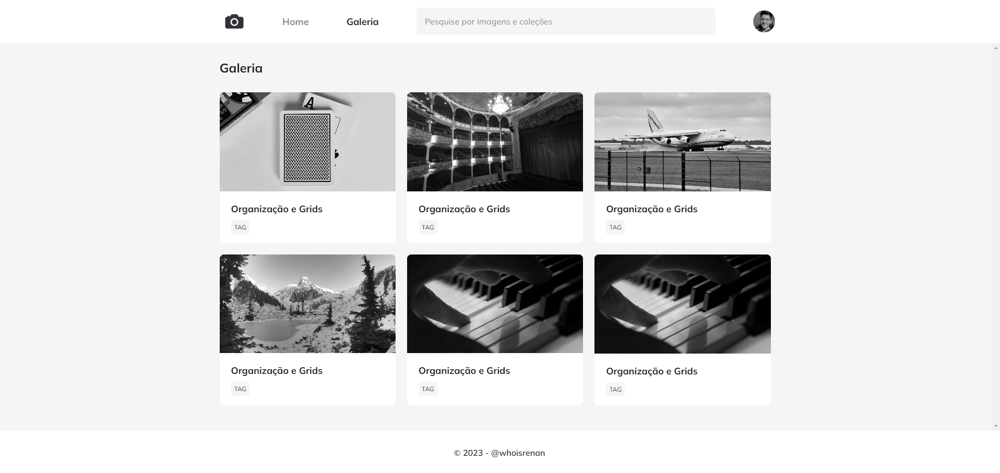
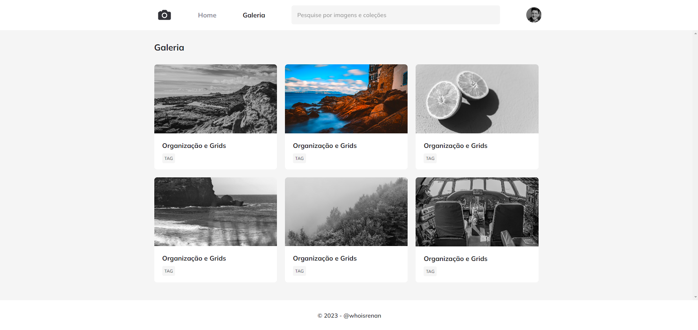

<h1 align="center">FotoBlog</h1>
<h3> Projeto sobre CSS Animations desenvolvido no Explorer da Rocketseat.</h3>

## Descrição do Projeto

Esse Projeto foi desenvolvido no Explorer da Rocketseat com o intuito de explorar um pouco mais sobre o CSS Animation. Nele, optei por deixar toda a página em preto e branco, e ao passar o mouse por cima de uma imagem, ela ficar colorida. Também foram explorados animações onde ao carregar a página e passar o mouse em cima de um elemento, aumentar sua escala.

## Instalação

Basta baixar o repositório na sua máquina, abrir na IDE de sua preferência e executar o arquivo HTML em seu navegador.

## Licença

MIT License.
Copyright (c) 2022.

## 🚀 Tecnologias Utilizadas

